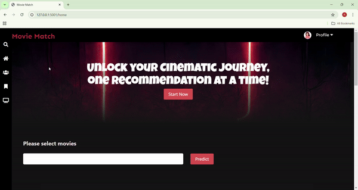
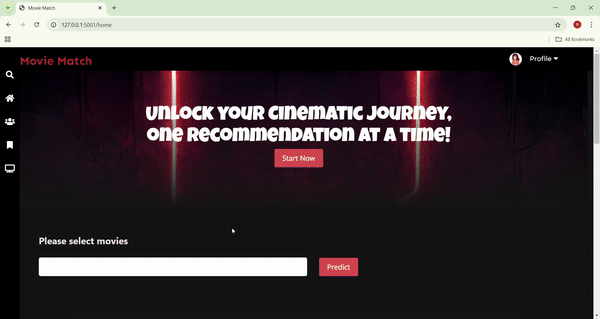
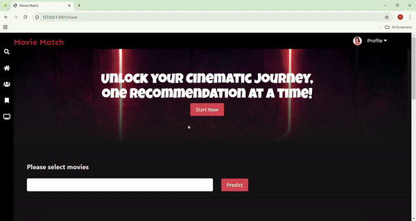

# <i>Movie Match 🎥 </i>
    Discover Your Next Movie Night Gem!

 
 
 
           

Are you tired of endless scrolling to find the perfect movie? Movie Match offers an expertly curated collection of must-watch films tailored to your tastes, all in a sleek and user-friendly interface.  
Start exploring now and let the magic of movies unfold! 🍿✨
## Sneak peak! :wink:
  
 <be>
  

# <b>Contents</b>

- [Introduction](https://github.com/SE-Fall2024/MovieRecommender/tree/master?tab=readme-ov-file#introduction-%EF%B8%8F) 
- [New Features](https://github.com/SE-Fall2024/MovieRecommender/tree/master?tab=readme-ov-file#introduction-%EF%B8%8F) 
- [Future Project Plan](https://github.com/SE-Fall2024/MovieRecommender/edit/master/README.md#future-scope-)  
- [Video](https://github.com/MadhurDixit13/MovieRecommender#video-%EF%B8%8F) 
- [Working](https://github.com/MadhurDixit13/MovieRecommender#working-) 
- [Tech Stack](https://github.com/MadhurDixit13/MovieRecommender#tech-stack-) 
- [Requirements and Setup](https://github.com/MadhurDixit13/MovieRecommender#requirements-and-setup-%EF%B8%8F) 
- [Usage](https://github.com/MadhurDixit13/MovieRecommender#usage) 
- [Documentation](https://github.com/MadhurDixit13/MovieRecommender#documentation-) 
- [Bug](https://github.com/MadhurDixit13/MovieRecommender#bug-) 
- [License](https://github.com/MadhurDixit13/MovieRecommender#license-%F0%9F%93%83)

## Introduction 👁️

Get ready to embark on an exhilarating cinematic journey! Dive into our expertly curated collection of must-watch movies, all tailored to ignite your passion for film. With our sleek and user-friendly interface, your movie night experience is about to become smoother and more thrilling than ever before.
 
Why wait? Your perfect film is just a click away! Start exploring now and let the magic of movies unfold! 🍿✨ 
 

## Exciting New Features Just for You 🎉

- **Instant Recommendations:** Start exploring with a curated list of movies, handpicked to spark your interest immediately.
- **Watch History:** Easily track every movie you've enjoyed, making it simple to revisit your favorites.
- **Wishlist:** Save movies you’re excited to watch later—never miss out on a potential gem!
- **Like Button:** Show your love for your favorite films! Each like helps us refine your recommendations further.
- **In-Depth Movie Details:** Click on movie images for comprehensive information, including plots, trailers, and ratings—your one-stop hub for all things cinema!
- **💻 Fresh UI and Smooth Navigation:** Enjoy a redesigned interface that ensures a seamless and enjoyable browsing experience.

Your perfect film is just a click away! Get started now and transform every movie night into a blockbuster experience! 🍿

  

##  Future Scope 🚀:

- **Comments Section:** Enable users to leave comments under each movie page for better engagement and discussion.
- **Website Deployment:** Launch the website with enhanced scalability to accommodate a growing user base.
- **Two-Factor Authentication (2FA):** Implement 2FA for improved user security and account protection.
- **Dislike Functionality:** Allow users to express their preferences with a dislike option for more refined recommendations.
- **Manage Watchlist and Wishlist:** Enable users to easily remove movies from their watchlist and wishlist for better organization.

Note: Our system can be virtually tested through Github Actions inbuilt feature of build and test queries using python.

Make sure you taste your own medicine first and take into account other peoples familiarity with the system before you design your tests.

## Video ▶️ 

## Working 📱

- Below working displays the system also evaluates movie attributes such as genre, cast, director, and user-generated reviews. 
- By combining these user-specific data and film characteristics, the recommender system employs machine learning to generate tailored movie recommendations.
- This enables users to discover new films that align with their individual tastes, making the movie-watching experience more enjoyable and engaging. 
- Furthermore, recommender systems often employ a feedback loop, where users' interactions and feedback help refine the recommendations over time, ensuring that the suggestions remain relevant.

## Tech stack used 👨‍💻

Python

Python is a high-level, general-purpose programming language known for its simplicity and readability. It is often used to build websites and software, automate tasks, conduct data anaysis and more.

Flask

Flask is a micro web framework written in Python. It's lightweight and easy to use for building web applications, making it a perfect choice for small to medium-sized projects.

HTML

HTML (Hypertext Markup Language) is the standard markup language for creating web pages and web applications. It's used for structuring the content on the web.

CSS

CSS (Cascading Style Sheets) is a style sheet language used for describing the look and formatting of a document written in HTML. It's essential for web design and layout.

JavaScript

JavaScript is a versatile and widely used programming language for adding interactivity and dynamic behavior to web pages. It's essential for client-side web development.

## Requirements and Setup ⚙️

- python 3.5 +
- pip
- Style check  - black
    `pip install black`
- Static code analyser - Pylance
    `Install it in VS Code`

- Install all required python packages
    `pip install -r requirements.txt `

## Usage
1. `cd Code/recommenderapp`
2. `python3 app.py`

## Follow these steps to run our project on your system! 🔮
1. Clone the project onto your system.
2. Incluse an api_key.txt file with the api key for the movie API - Take a look at this link: (https://developer.themoviedb.org/reference/intro/getting-started).
3. Install the following packages:
   
   a. `pip install flask-sqlalchemy`

   b. `pip install flask-bcrypt`

   c. `pip install flask-login`

   d. `pip install flask-wtf`

   e. `pip install email-validator`
   
5. Follow these steps to create the database -> Execute in python terminal:
 
   a. `from movierecommender import db`
   
   b. `from movierecommender.models import User,Post,WishlistItems, Watched, MovieLikes`
   
   c. `db.create_all()`
   
7. Run `cd Code/recommenderapp` and `python3 app.py`

## Documentation 📚
Refer to Wiki page [here](https://github.com/MadhurDixit13/MovieRecommender/wiki/Documentation)

## Bug? 🐛
Raise a issue on this repository, we would love to look at it ❤️

## License 📃
This project is under MIT License.
- The MIT license explicitly grants users the right to reuse code for various purposes,hence for improval of future scope of the code we have added MIT license.
- They include the original MIT license when distributing it. Allowing users to customize or adapt the code to meet their specific requirements.
